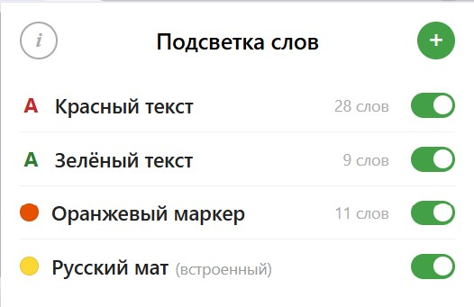

# Подсветка нецензурных слов 🇷🇺

Браузерное расширение для подсветки слов на веб-страницах. Встроенные паттерны для нецензурной лексики + возможность создавать собственные списки слов.

## 🌟 Особенности

### 🔍 Подсветка слов
Расширение выделяет слова цветом (маркер или цвет текста), но не скрывает и не заменяет их. Вы видите текст целиком, просто с визуальной пометкой.

### 📋 Собственные списки слов
Создавайте списки слов или импортируйте из текстовых файлов (.txt). Каждый список можно отключить, настроить цвет и стиль подсветки.

### 🧠 Умные паттерны поиска (регулярные выражения)
В отличие от обычных расширений с готовыми списками, используются регулярные выражения, что позволяет:
- Ловить любые вариации слов, включая неизвестные ранее
- Распознавать визуальные замены символов (`3алупа`, `еб@`, `×уй`)
- Фильтровать ложные срабатывания через контекст
- Не требовать постоянного обновления списка

### 🎨 Настраиваемая подсветка
Каждый список имеет свой цвет (9 цветов на выбор) и стиль: фон (маркер) или цвет текста.

### 🖱 Контекстное меню
Выделите слово на странице, нажмите правой кнопкой — добавьте/переместите его в любой список или удалите из списка.

### ⚡ Динамические страницы
Работает с динамическим контентом: чаты, ленты, SPA — MutationObserver + setInterval(fallback) для всех изменений DOM.

## 🎯 Актуальные паттерны (версия 2.0.2)

| Паттерн | Примеры |
|---------|---------|
| `BLYAD` | блядь, бляди |
| `BLYAT` | блять, блят |
| `DOLBO` | долбоёб, долбаёб |
| `EB` | еб, ебё (короткие формы) |
| `EBA` | ебать, ебобо, еба |
| `EBLO` | ебло, еблу |
| `HUI` | хуй, хуя, хуё |
| `HUY` | хуй (доп. контекст) |
| `HUYN` | хуйн, хуйня |
| `IBI` | иби, ибит |
| `IPA` | ипа, ипу |
| `MAND` | манда, манде |
| `PIDOR` | пидор, пидора |
| `PEST` | пест, пестом |
| `PISD` | писда, писдой |
| `PITАR` | питар, питара |
| `PITER` | питер (исключение ложных срабатываний) |
| `PIZD` | пизда, пизде |
| `PIZH` | пиж, пижу |
| `PLYA` | пля, плям |
| `ZALUPA` | залупа, залупу |

Каждый паттерн представляет собой регулярное выражение, которое учитывает возможные замены символов и контекстные ограничения для минимизации ложных срабатываний.

## 🎨 Распознаёт визуальные замены символов

| Символ | Заменяет |
|--------|----------|
| `3` | з |
| `6`, `δ` | б |
| `0` | о |
| `@` | а |
| `×`, `x` | х |
| `y`, `¥` | у |
| `p` | р |
| `$` | с |
| `α` | а |
| `ë` | е |
| `π` | п |
| `ӆ` | л |
| `Ñ` | н |

А также заглавные/строчные варианты кириллических и латинских букв.

## ✅ Что НЕ подсвечивается
- Обычные слова: `тебя`, `хлеб`, `ребёнок`, `себя`, `небо`, `команда`
- Технические идентификаторы (хеши, ссылки)
- Уже подсвеченные другими расширениями слова (решение конфликтов)
- Слова внутри `INPUT`/`TEXTAREA`

## ⚙️ Технические детали

### Версия 2.0.2 (текущая)
- ✅ Встроенные паттерны для нецензурной лексики (21 регулярное выражение)
- ✅ Поддержка пользовательских списков: ручной ввод и импорт из .txt файлов
- ✅ Per-list настройка: цвет (9 цветов), стиль (маркер/текст), включение/отключение
- ✅ Сохранение списка в .txt: экспорт любого пользовательского списка в текстовый файл через кнопку в редакторе
- ✅ Проверка повторов при загрузке из файла: автоматическое удаление дубликатов внутри файла; слова, уже существующие в других списках, пропускаются
- ✅ Визуальная индикация дубликатов: слова, встречающиеся в нескольких списках, выделяются красным цветом в редакторе со ссылками на другие списки
- ✅ Контекстное меню: добавление/удаление слов по правому клику
- ✅ Обработка динамического контента: MutationObserver + setInterval fallback 300 мс
- ✅ Разрешение конфликтов с другими расширениями подсветки
- ✅ Работа во всех фреймах (cross-frame support)
- ✅ Настройка игнорируемых сайтов через интерфейс расширения

## 🚀 Установка

### Как расширение для браузера

1. Скачайте репозиторий:
   - `git clone https://github.com/Vova-iz-Tambova/rus-uncensored-words-highlight.git`
   - Или кнопка **Code** → **Download ZIP**
2. Распакуйте архив (если скачивали ZIP) в любую папку
3. Откройте браузер и перейдите в настройки расширений:
   - **Chrome/Edge/Yandex/Opera:** Меню (⋮) → Расширения → Управление расширениями → Включите **Режим разработчика** → **Загрузить распакованное расширение**
   - **Firefox:** Меню (☰) → Дополнения и темы → Расширения → Шестерёнка ⚙️ → Отладка дополнений → Загрузить временное дополнение
4. Выберите папку с расширением
5. Готово! Расширение работает на всех сайтах (кроме указанных в настройках: по умолчанию `*.avito.ru`).

## 🎨 Примеры работы

| Текст | Результат |
|-------|-----------|
| хуй | подсвечивается |
| пизда | подсвечивается |
| 3алупа | подсвечивается |
| еб@ | подсвечивается |
| ×уй | подсвечивается |
| дохуя | подсвечивается (часть "хуя") |
| выебал | подсвечивается (часть "еба") |
| ебобо | подсвечивается |
| уeбаное | подсвечивается (с латинской e) |
| тебя | не подсвечивается |
| хлеб | не подсвечивается |
| питер | не подсвечивается |

## 📦 Структура проекта

- `manifest.json` – конфигурация расширения
- `content.js` – основной скрипт, который выполняется на страницах
- `background.js` – Service Worker (контекстное меню, инициализация)
- `patterns.js` – паттерны регулярных выражений
- `popup.html` – всплывающее окно расширения
- `popup.js` – логика интерфейса popup
- `icons/` – иконки расширения
- `screenshots/` – скриншоты

## 🔧 Разработка

Паттерны регулярных выражений хранятся в `patterns.js`. Для добавления нового паттерна:
1. Создайте новую константу `PATTERN_XXXX`
2. Добавьте её в массив внутри `regex`
3. Протестируйте на различных текстах

## 🔮 Планы на будущее
- [ ] Пользовательские паттерны (свои регулярные выражения)
- [ ] Групповые операции со словами из списка

## 👤 Автор

**Vova-iz-Tambova**

- GitHub: [@Vova-iz-Tambova](https://github.com/Vova-iz-Tambova)
- Репозиторий: [rus-uncensored-words-highlight](https://github.com/Vova-iz-Tambova/rus-uncensored-words-highlight)

## 📄 Лицензия

MIT